# FireWallet
Experimental wallet for Handshake chain

## Installation
### From Releases
You can install the latest release from [here](https://github.com/Nathanwoodburn/FireWallet/releases/).
### Build from source
You can build from source by cloning this repo.  
You will need Visual Studio (recommend a recent version) and .net desktop development tools installed.

## Setup
### Create a new wallet
You can create or import a wallet by clicking on the `New` button from the login screen.  
You will need to enter a password to encrypt your wallet.  
This password will be used to encrypt your wallet and to login to your wallet.  
**At the moment exporting your Seed Phase does not work**

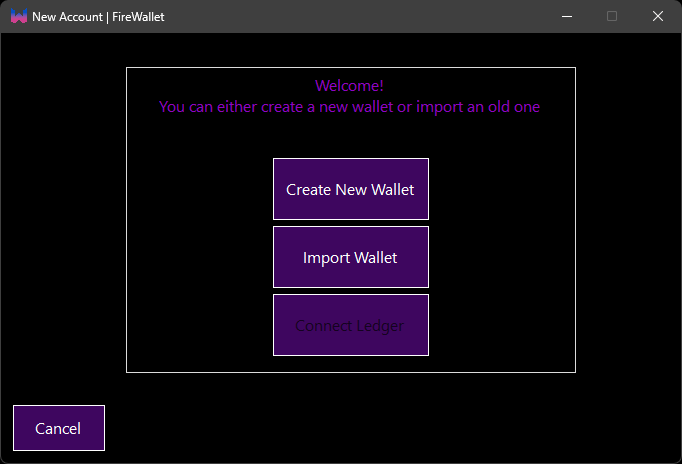

## First time setup
When you first open the wallet you will be prompted to set your node settings.

You can get the API key from the HSD launch command or 
in Bob wallet under settings > Wallet > API key.  
If you change this key in HSD or Bob you will need to update it in FireWallet.  

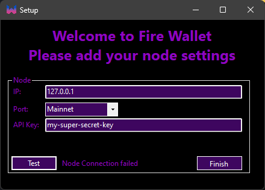  
If you need to change your Node settings you can edit the file in `%appdata%\FireWallet\node.txt`

    
# Usage

Login to your wallet by entering your password (the same as the Bob password).  
This password will be stored in memory until you Logout or close the wallet.  
This means you will not need to enter your password again until you close the wallet.  

# Portfolio
The portfolio page shows your current balance.  
The locked balance is the amount of HNS that is currently locked in auctions.  
This also includes the amount of HNS that is locked in closed auctions (aka the spent bid).  

This page shows a list of your transactions.  
Clicking on a Hash will open the transaction in an explorer.  
You can change the number of transactions shown in the `portfolio-tx:` settings.

 

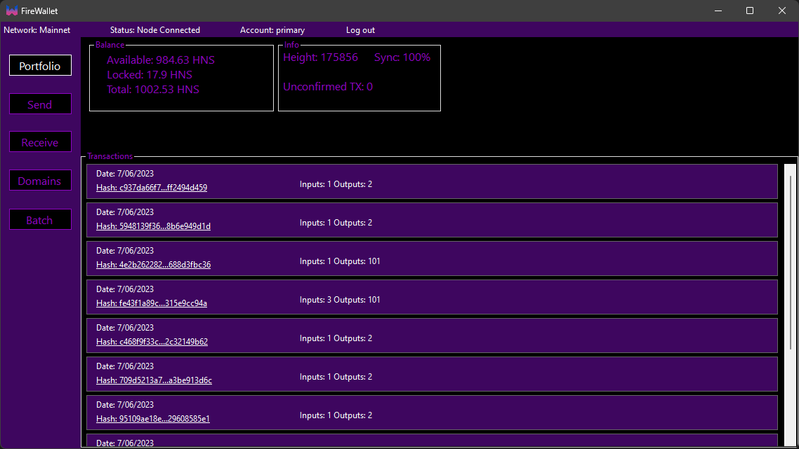

  
## Sending HNS
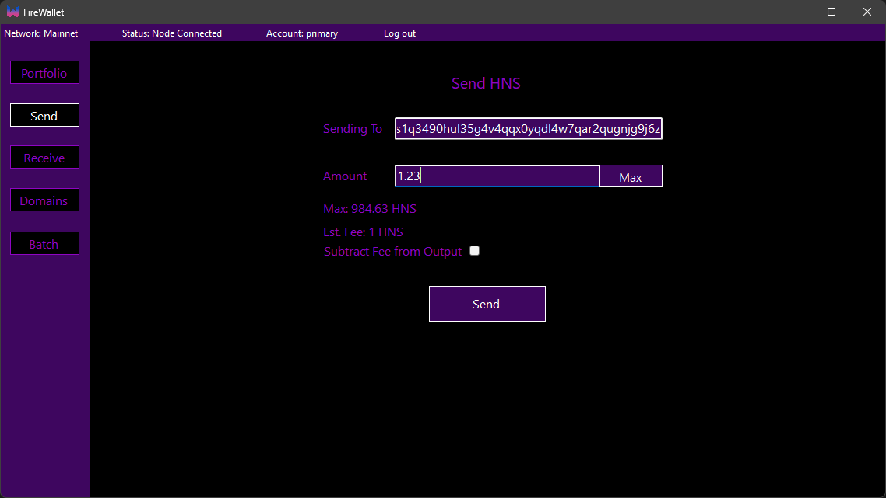

## Receiving HNS or Domains
The receive page shows your current HNS address.  
This is the address you can give to people to send you HNS or domains.  
This address will change every time you receive HNS or domains to prevent address reuse.

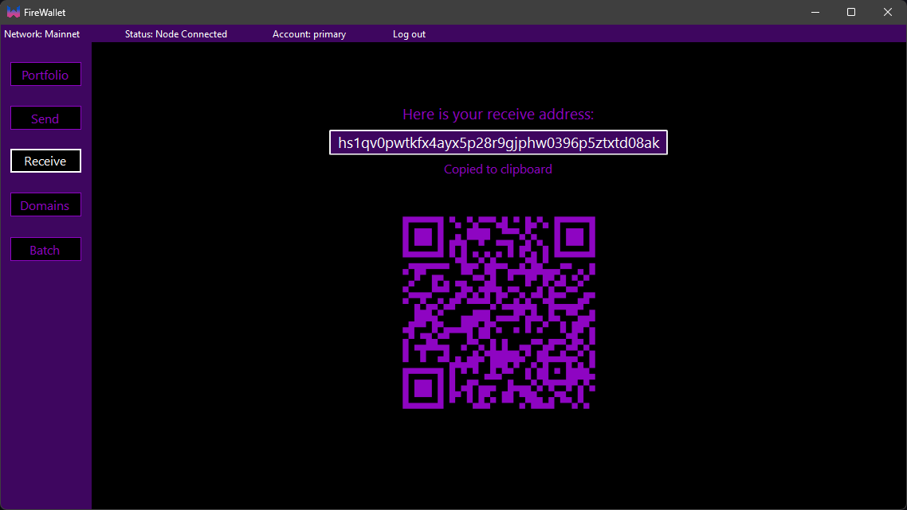

## Domains
The domains page shows a list of your domains.  
It also lets you search for domains.
Clicking on a domain will open the domain in the domain windows.

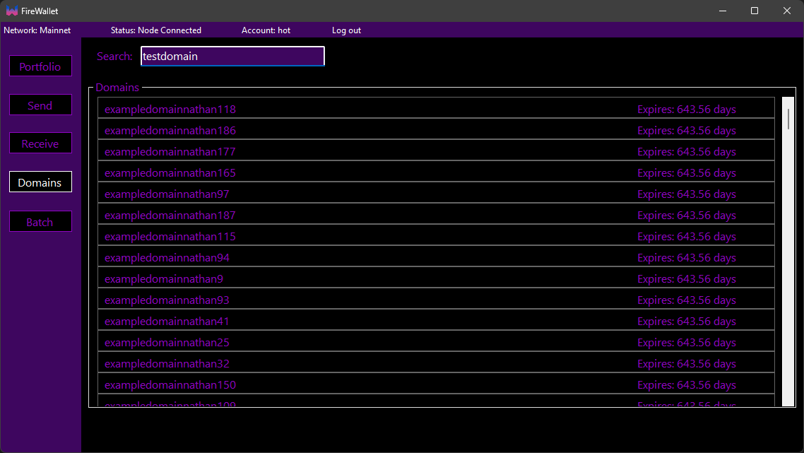

The domain windows shows the details of the domain.  
This window also lets you auction and manage domains.  

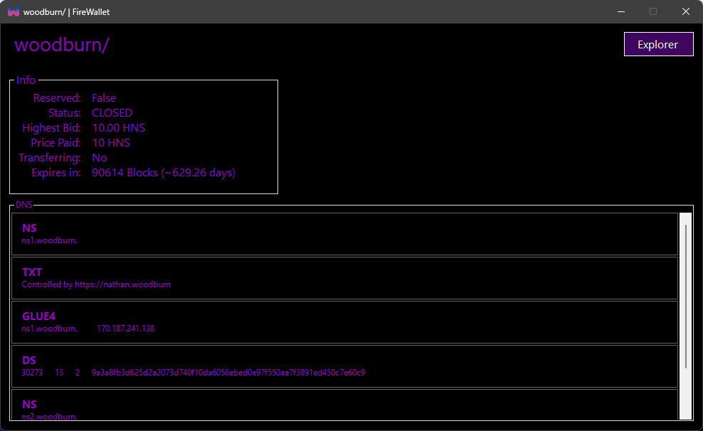
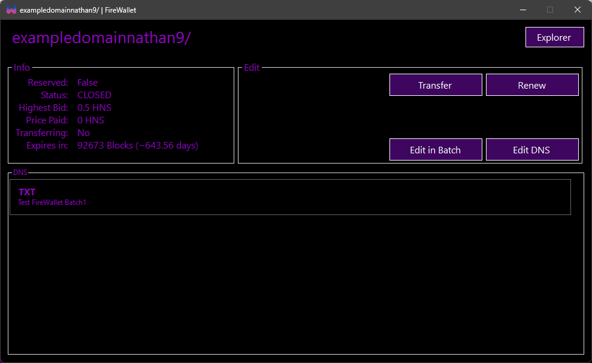
## Manage Domains
You can update the records of your domains by clicking on the `Edit DNS` or `Edit in Batch` buttons.  
This will open a window where you can edit the records of your domain.  
After you have made your changes you can click the `Send` button to either send the transaction to the network or to the batch window.

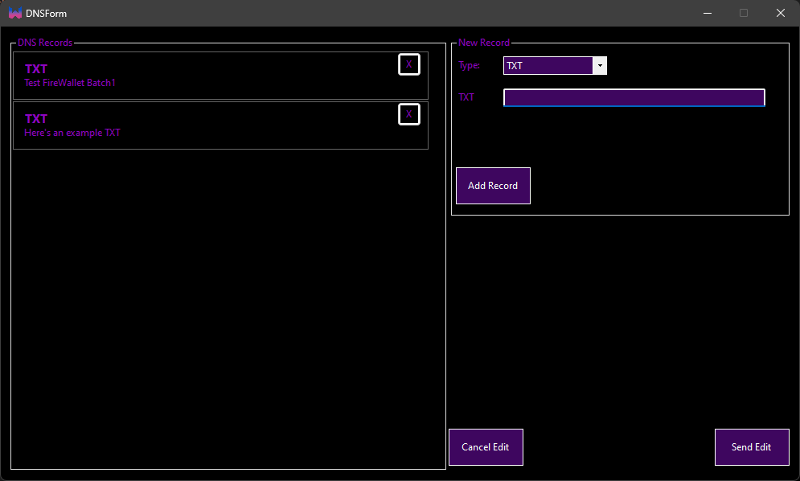

# Batching
The batch window lets you send multiple transactions at once.  
You can add transactions to the batch from the domain window or the DNS editor.  

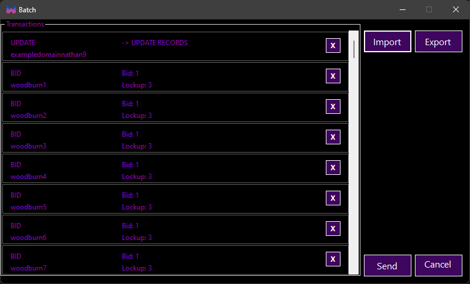

## Importing
You can also import a list of domains to the batch window.  
The "CANCEL" transaction type is used to cancel an transfer.

At the momemt "UPDATE" or coin only transactions are not supported.

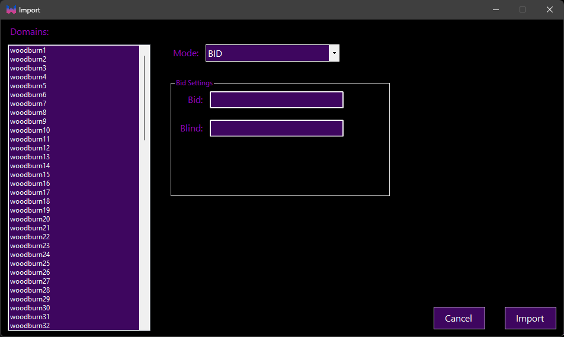

## Exporting
You can export the batch to a file.  
This file will store the transaction type, name, and any data needed to send the transaction.  
You can then import this file to send the transactions.  
An example of this file can be found [here](example-configs/batch.txt).

# Ledger
You can use a Ledger device to sign transactions.  
You need to have Node, NPM, and git installed to use Ledger.  
The Ledger components are not included in the app.  
These will install when you first send HNS (not domains) from a Ledger.
